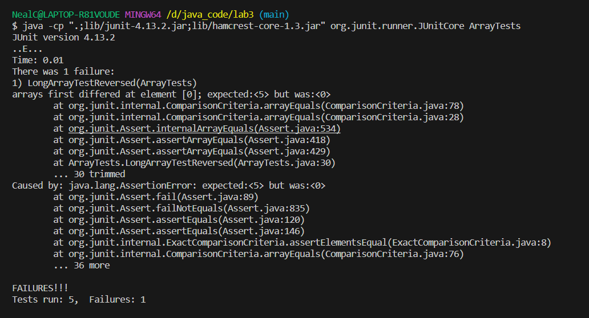
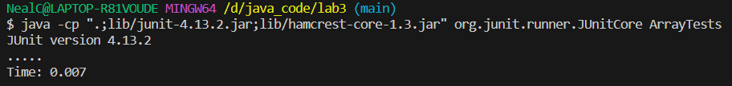

# LabReport3

## Part 1 - Bugs
- A failure-inducing input for the buggy program, as a JUnit test and any associated code (write it as a code block in Markdown):
  ```
  @Test
  public void LongArrayTestReversed() {
    int[] input1 = {1,2,3,4,5};
    int[] input = ArrayExamples.reversed(input1);
    assertArrayEquals(new int[]{5,4,3,2,1}, input);
  }
  ```
- An input that doesn't induce a failure, as a JUnit test and any associated code (write it as a code block in Markdown):
  ```
  @Test
  public void LongArrayTestReversed1() {
    int[] input1 = {0};
    int[] input = ArrayExamples.reversed(input1);
    assertArrayEquals(new int[]{0}, input);
  }
  ```
- The symptom, as the output of running the tests (provide it as a screenshot of running JUnit with at least the two inputs above):
  
- The bug, as the before-and-after code change required to fix it (as two code blocks in Markdown):
  before:
  ```
    static int[] reversed(int[] arr) {
    int[] newArray = new int[arr.length];
    for(int i = 0; i < arr.length; i += 1) {
      arr[i] = newArray[arr.length - i - 1];
    }
    return arr;
  }
  ```
  after:
  ```
    static int[] reversed(int[] arr) {
    int[] newArray = new int[arr.length];
    for(int i = 0; i < arr.length; i += 1) {
      newArray[i] = arr[arr.length - i - 1];
    }
    return newArray;
  }
  ```
  
  - Briefly describe why the fix addresses the issue: it should return the `newArray` instead of `arr`, and inside the for loop, `newArray` is the one that needs to be assigned with values from `arr`
 
  # Part 2 - Reseaching commands
  4 interesting command-line options of grep, give 2 examples of using it on files and directories from ./technical:
- 1.1(From Chat GPT)
```
  $ grep -r "urgent" --include \*.txt ./911report/
./911report/chapter-10.txt:            As the urgent domestic issues accumulated, White House Deputy Chief of Staff Joshua
./911report/chapter-12.txt:                anti-U.S. insurgents in Iraq, although majorities also condemn jihadist attacks in
./911report/chapter-13.3.txt:                pressing Bandar, conveying the urgent need for information. CIA cable, DCI meeting
./911report/chapter-13.4.txt:                underlining of the word urgently in original). Clarke's staff called on other
./911report/chapter-13.5.txt:                the matter was urgent and, having consulted DOD directives, concluded he had the
./911report/chapter-3.txt:                urgent need to increase the FBI's counterterrorism capability. His plan, called
./911report/chapter-3.txt:                get another chance." An urgent teleconference of principals was arranged.
./911report/chapter-6.txt:                paper." We urgently need . . . a Principals level review on the al Qida network,"
./911report/chapter-8.txt:                a meeting about a more urgent matter on September 3, and sent the British service a
./911report/chapter-9.txt:                urgently had they known of the South Tower's complete collapse. Other firefighters
./911report/chapter-9.txt:                reiterated his urgent message.
./911report/chapter-9.txt:                leave the complex urgently but calmly. It is impossible to measure how many more
./911report/chapter-9.txt:                possible an urgent evacuation order explaining the South Tower's full collapse.
```
Why useful: recursively finds the pattern exists within the files in certain folder, it could be really useful to target a specific phrase in a specific file


- 1.2(From Chat GPT)
```
$ grep -r "Darwin" --include \*.txt ./biomed/
./biomed/1471-2105-3-2.txt:        In the 1830's, Charles Darwin's investigation of the
./biomed/1471-2105-3-2.txt:        In the 1970's, Woese and Fox revisited Darwinian
```
Why useful: recursively finds the pattern exists within the files in certain folder, it could be really useful to target a specific phrase in specific file with specific file extension

- 2.1(From Chat GPT)
```
$ grep -r "Darwin" ./biomed
./biomed/1471-2105-3-2.txt:        In the 1830's, Charles Darwin's investigation of the
./biomed/1471-2105-3-2.txt:        In the 1970's, Woese and Fox revisited Darwinian
```
Why useful: it recursively search for the pattern in all files of a directory and its subdirectories, it could be a alternative way of showing the result of 1.2, it could be really useful to target a specific phrase in a specific file

- 2.2(From Chat GPT)
```
$ grep -r "Darwin" 
biomed/1471-2105-3-2.txt:        In the 1830's, Charles Darwin's investigation of the
biomed/1471-2105-3-2.txt:        In the 1970's, Woese and Fox revisited Darwinian
plos/journal.pbio.0020046.txt:        answers to possible questions and criticisms to avoid stuttering. Charles Darwin also
plos/journal.pbio.0020046.txt:        stuttered; interestingly, his grandfather Erasmus Darwin suffered from the same condition,
plos/journal.pbio.0020071.txt:        are many ideologically motivated books opposing natural selection and Darwinism. To
plos/journal.pbio.0020302.txt:        turn to be consumed by predators. Darwinian evolution would result in many of the same
plos/journal.pbio.0020311.txt:        out by Charles Darwin and his son Francis in 1880. The Darwins were able to demonstrate
plos/journal.pbio.0020346.txt:        on the traditional comparative approach, which was always the strength of Darwinian
plos/journal.pbio.0020347.txt:        described by Charles Darwin (1859).
plos/journal.pbio.0020347.txt:        Not all genetic variation is created equal. When Darwin first introduced the concept of
plos/journal.pbio.0020347.txt:        evolution (Darwin 1859), he challenged the prevailing view that species were fixed entities
plos/journal.pbio.0020439.txt:        location within the head (Hsieh 2003). Charles Darwin was right when he wrote that people
plos/journal.pbio.0020439.txt:        extra sense” (F. Darwin 1905). Today's biologists increasingly recognize that appropriate
```
Why useful: it recursively search for the pattern in all files of a directory and its subdirectories, it could be really useful to target a specific phrase in a specific file with the relative path.

3.1(can only be used on files)(From Chat GPT)
```
$ grep -w "Charles" plos/journal.pbio.0020311.txt
        out by Charles Darwin and his son Francis in 1880. The Darwins were able to demonstrate
```
Why useful: will match "pattern" only when it appears as a whole word in file.txt.

3.2(cannot be used on a directory)(From Chat GPT)
```
grep -w "grandfather" plos/journal.pbio.0020311.txt

```
Why useful: will match "pattern" only when it appears as a whole word in file.txt.

- 4.1(From Chat GPT)
```
$ grep -c "consent" ./911report/
grep: ./911report/: Is a directory
0
```
Why useful: output the number of lines in all files in the directory that match the "pattern", useful when asked to find the number of lines in some files that match the "pattern"

- 4.2(From Chat GPT)
```
$ grep -c "comparison" ./government/About_LSC/Comments_on_semiannual.txt
0
```
Why useful: output the number of lines in a file that match the "pattern", useful when asked to find the number of lines in a that match the "pattern"
